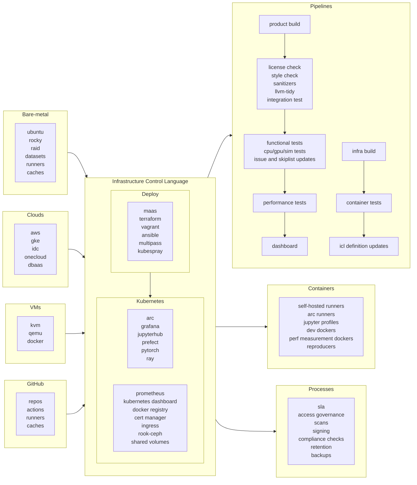

# Infrastructure Control Language

Infrastructure control language - ICL is a software development kit comprised of tools and a library that allows you to:
* Easily run your workload locally and on any cloud directly with simple from within your code.
* Simplifies the Infrastructure as Code approach by providing a semantically unified API across all of your infrastructure
* logically separates the infrastructure control part from the code logic directly in Python
* integrates your favorite tools, i.e., Jupyter Notebooks and VS Code, with your favorite add-ons to make you feel at home everywhere.

Deployment tools allow you to create a working environment, e.g., for your deep learning or LLM development, with the exact match of the dependencies anywhere - locally on your laptop, workstation, local cluster, public cloud environment, custom cluster in the public cloud with easy API calls. Such an option also allows you to run exactly the same program anywhere - start on your laptop and scale as you go to your favorite cloud.

To do so, you need to deal with only three semantically unified abstractions - _**infrastructure**_, comprised of compute, storage, and networking resources; _**runtime**_ with needed packages and dependencies; and _**program**_, which can denote either repetitive flow or a single program in Python.

We strongly believe that the developer should be able to run the program that is developed locally on any resource by prescribing the needed environment and running on it in the same program as the code logic instead of separately dealing with infrastructure, runtime and then changing the program to run on that environment.  We call this the _Runtime Dependency Inversion_ principle, bringing old good days back when you ran the program on the machine you developed.

The project is still in engineering Alpha mode. Please be sure to use it with caution. But let us know what you think!

## Quick start

The simplest way to start with ICL is to create a local ICL environment in a Docker container by calling customized Kind script:

```bash
git clone https://github.com/aregm/icl.git
cd icl
./scripts/deploy/kind.sh
```

The process will create endpoints accessible only from localhost:

* http://jupyter.localtest.me
* http://dashboard.localtest.me
* http://minio.localtest.me
* http://prefect.localtest.me

In your browser, navigate to http://jupyter.localtest.me and start using.

## Running a simple program locally
ICL allows running a Python program both locally and on a cloud.

Create a Python file `my_program.py`:

```python
if __name__ == '__main__':
    print('Hello from my_program')
```

Then execute the program in your cluster:

```python
import infractl
local = infractl.infrastructure(address = 'localtest.me')
await infractl.run(infractl.program('my_program.py'), infrastructure = local)
```
This will run the program in the default environment locally. If you have cloud credentials, run the script, e.g., aws.sh

```bash
./scripts/deploy/aws.sh
```
This will create an EKS cluster on AWS and after that you can run the same program on AWS.

```python
import infractl

aws = infractl.infrastructure(address = 'aws.myinfra.com') # This example assumes that you bound EKS to a DNS host myinfra.com. See docs for details.
await infractl.run(infractl.program('my_program.py'), infrastructure = aws)
```

## Running repetetive flow
ICL allows running a repetitive Python program using [Prefect](https://docs.prefect.io/) flow in a cluster.

Create a Python file `my_flow.py` with Prefect flow definition:

```python
from prefect import flow
from prefect.logging import get_run_logger

@flow
def my_flow():
    logger = get_run_logger()
    logger.info('Hello from my_flow')
```

Then execute the flow in your cluster:

```python
import infractl
local = infractl.infrastructure(address = 'localtest.me')
await infractl.run(infractl.program('my_flow.py'), infrastructure = local)
```
Then, if you navigate to the Prefect dashboard http://prefect.localtest.me you can see the flow output. 

## Use cases

### Reproducible development environments
ICL comes in very handy when you need to quickly create a development environment for your research team. 

A growing Triton development team initially struggled with shared, manually configured development environments on limited GPU hardware. System-level dependencies (e.g., compilers, different drivers, different system-level libraries) repeatedly broke each other’s setups, and the shortage of dedicated GPU machines compounded the problem.

To address this, the team introduced profiles and sessions through ICL:

* Profiles are named, versioned container images that include all required system- and project-level dependencies. A DevOps or dedicated build team maintains these profiles, ensuring consistency across the project.
* Sessions are developer workspaces based on a chosen profile. User files persist across sessions, while system dependencies remain tied to whichever profile is selected. Sessions can be accessed via web terminals, SSH, or remote IDEs; they can also be shared, cloned, snapshotted, and rolled back.

This container-based model controlled through ICL runs on a shared compute pool of machines, enabling more efficient resource usage and easier scaling—especially for GPU-heavy workloads. Developers can experiment in multiple sessions or switch profiles to match different project requirements without compromising each other’s environments. Ultimately, having well-maintained profiles and flexible sessions streamlines environment setup, minimizes dependency conflicts, and boosts overall team productivity.

### Unified operating environments
Software projects often use multiple environments: development, testing, staging, and production, each with distinct requirements for scale, access, security, and monitoring. However, they also share many common dependencies and configurations. Continuous Integration (CI) environments add further complexity, emphasizing reproducibility and isolation to ensure consistent builds between development and CI. Maintaining these environments can lead to configuration drift, where updates in one environment fail to propagate to others, creating gaps that cause numerous issues.

A recommended solution is to unify environment definitions as an ICL code, versioning all changes for automatic propagation. Environment-specific configurations (e.g., for staging or production) should be defined in the same code base. This approach significantly reduces configuration drift, allowing development, testing, and CI environments to share the same underlying infrastructure, maximizing resource usage. It aligns with emerging platform engineering practices, which aim to offer higher-level building blocks (beyond raw Terraform, Ansible, Kubernetes, or cloud APIs) for easier, more consistent reproducible environment management.

## Easy machine-learning environment with CI

ICL can be the backbone of your company's CI and ML infrastructure. Here is a component diagram which shows how it works
for us.



## Next steps
Check out our documentation at https://aregm.github.io/icl/.

