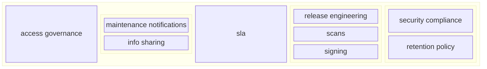

# Infrastructure Control Language

Tool to easily run your data science, machine learning or deep learning experiments anywhere: locally, on-prem clusters, or hybrid clouds
dynamically optimized for GPUs. 
Based on Infrastructure as Code, but pushed to the next level.
Provides cosmic level of infrastructure control bringing old good days back when you run program on the machine you develop.

Still in engineering Alpha mode. Use with caution. But let us know what you think!

## Quick start

The simplest way to start with ICL is to create a local ICL cluster in a Docker container:

```bash
git clone https://github.com/intel-ai/icl.git
cd icl
./scripts/deploy/kind.sh
```

The cluster's endpoints are accessible only from localhost:

* http://jupyter.localtest.me
* http://dashboard.localtest.me
* http://minio.localtest.me
* http://prefect.localtest.me

In your browser, navigate to http://jupyter.localtest.me.

Install Python package `infractl` package with `pip`:

```bash
pip install infractl
```

ICL allows running a local Python program of [Prefect](https://docs.prefect.io/) flow in a cluster.

Create a Python file `my_program.py`:

```python
if __name__ == '__main__':
    print('Hello from my_program')
```

Then execute the program in your cluster:

```python
import infractl

await infractl.run(infractl.program('my_program.py'))
```

Create a Python file `my_flow.py` with Prefect flow definition:

```python
from prefect import flow

@flow
def my_flow():
    print('Hello from my_flow')
```

Then execute the flow in your cluster:

```python
import infractl

await infractl.run(infractl.program('my_flow.py'))
```

Note that the program and flow can be developed, tested, and executed locally.
ICL allows executing the same program or flow in your local or remote ICL cluster.

## Next steps

In addition to a local ICL cluster, there are scripts to create multi node ICL clusters in AWS, GCP.
We also support deploying ICL into an existing Kubernetes or OpenShift clusters, provisioning bare-metal machines.
Check our documentation at https://aregm.github.io/icl/.

## Component diagram

ICL can be a backbone of your company CI and ML infrastructure, here is a component diagram which shows how it works
for us.


